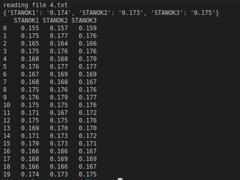

## Usage

Использовать из под терминала питоний скрипт.

```bash
python python_csv_fetcher.py reports/ 2
```
Первый аргумент в скрипт - папка с текстовыми отчетами прогона гыпыэсэс.
Второй аргемент - индекс колонки, которую надо обработать. 2, в данном случае, это UTILIZATION.
P
Использован Python 3.7, все библиотеки стандартные, идущие в Anaconda.

<i> Пример таблички для трех станков, где ячейками выступают значения утилизации каждого станка</i>
